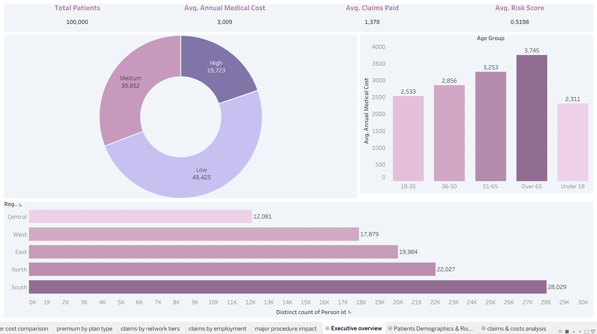
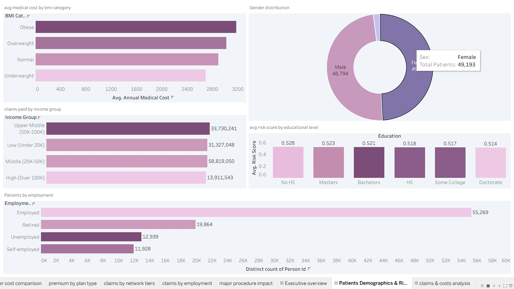
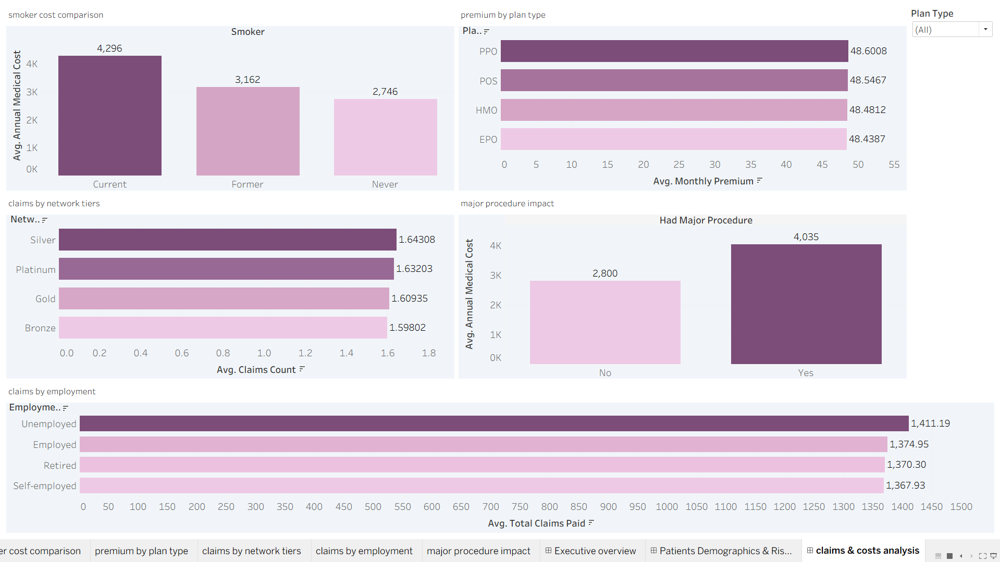
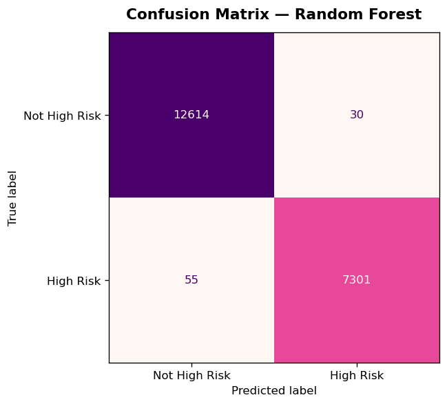
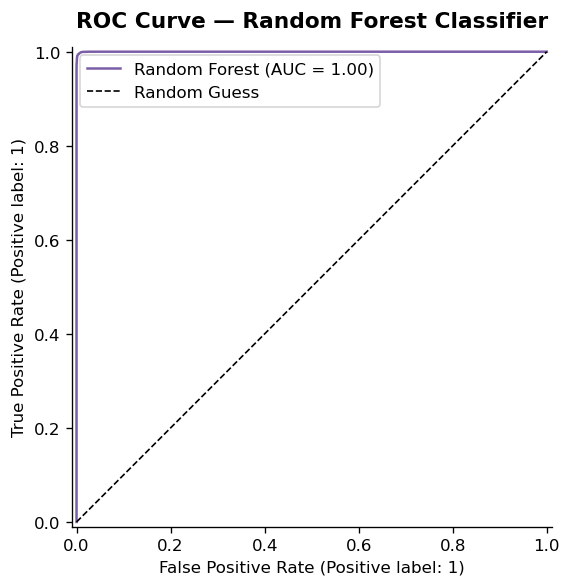
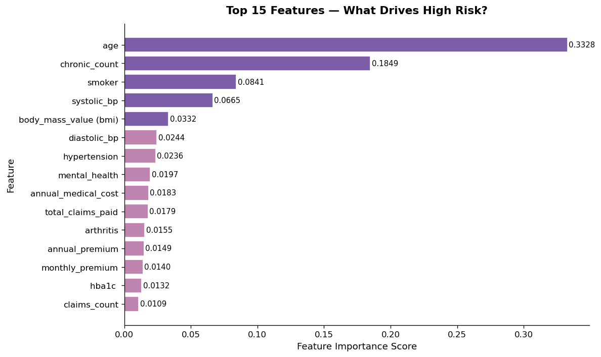

# Healthcare Insurance Claims Analysis
### Predictive Risk Modelling & Claims Intelligence


---

## Project Overview

This end-to-end data analytics project analyses a **100,000-patient healthcare insurance claims dataset** to uncover cost drivers, risk patterns, and demographic insights relevant to a health insurance business.

The project covers the full analytics pipeline - from raw data cleaning in Excel, structured querying in MySQL, interactive dashboards in Tableau, through to a **machine learning model** that predicts whether a patient is likely to be classified as high risk.

This kind of analysis supports real business decisions around underwriting, premium pricing, care management programme targeting, and claims cost reduction.

---

## Business Questions Answered

- Which patient demographics and health factors drive the highest medical costs?
- What is the relationship between BMI, smoking status, and annual medical cost?
- How does chronic condition count correlate with high risk classification?
- Which income groups account for the highest total claims paid?
- Can we accurately predict high-risk patients from their profile data alone?
- What are the top clinical and demographic drivers of patient risk?

---

## Tech Stack

| Tool | Purpose |
|------|---------|
| **Excel** | Data cleaning, validation, pivot exploration |
| **MySQL** | Structured querying and aggregation analysis |
| **Tableau** | Interactive dashboards and visual storytelling |
| **Python — Pandas, Matplotlib, Seaborn** | EDA and visualisation |
| **Python — Scikit-learn** | Random Forest classification model |
| **Jupyter Notebook** | ML development and documentation |

---

## Dataset

- **Source:** Kaggle — Healthcare Insurance Claims Dataset
- **Size:** 100,000 patients · 55 columns
- **Key fields:** Age, sex, region, BMI, smoker status, 10 chronic condition flags, plan type, network tier, annual medical cost, total claims paid, risk score, `is_high_risk`
- **Missing values:** 0 — fully clean dataset

---

## Project Structure

```
healthcare-insurance-claims-analysis/
│
├── data/
│   └── medical_insurance_cleaned.csv      # Cleaned dataset (100K rows)
│
├── sql/
│   └── healthcare_queries.sql                # MySQL queries used in analysis
│
├── notebooks/
│   └── healthcare_risk_prediction.ipynb      # Full ML notebook with explanations
│
├── tableau/
│   └── medical_insurance_tableau.twb         # Tableau workbook — 3 dashboards
│
├── images/
│   ├── dashboard_executive_overview.png
│   ├── dashboard_demographics_risk.png
│   ├── dashboard_claims_costs.png
│   ├── eda_target_distribution.png
│   ├── eda_age_distribution.png
│   ├── eda_smoker_risk.png
│   ├── eda_chronic_risk.png
│   ├── eval_confusion_matrix.png
│   ├── eval_roc_curve.png
│   └── feature_importance_top15.png
│
└── README.md
```

---

## Tableau Dashboards

Three interactive dashboards were built covering the full patient and claims story.

---

### Dashboard 1 — Executive Overview
High-level KPIs and summary metrics for a leadership audience.

**Key metrics:** Total Patients: 100,000 · Avg. Annual Medical Cost: $3,009 · Avg. Claims Paid: $1,378 · Avg. Risk Score: 0.5198

**Visuals:** Risk tier donut (Low / Medium / High), regional patient distribution, medical cost by age group



---

### Dashboard 2 — Patient Demographics & Risk
Demographic and risk pattern analysis across the patient population.

**Visuals:** Avg cost by BMI category, gender distribution, claims by income group, avg risk score by education level, patient count by employment status



---

### Dashboard 3 — Claims & Cost Analysis
Detailed cost driver and claims behaviour analysis.

**Visuals:** Smoker cost comparison (Current / Former / Never), premium by plan type, claims by network tier, major procedure cost impact, claims by employment status



---

## Machine Learning — High Risk Patient Prediction

### Objective
Build a binary classification model to predict whether a patient will be classified as **High Risk** (`is_high_risk` = Yes / No) based on their demographic, health, lifestyle, and claims profile.

### Why Random Forest?
A **Random Forest Classifier** was selected because it handles mixed data types without extensive preprocessing, produces feature importance scores that are directly interpretable for business stakeholders, and is robust against overfitting through ensemble voting across 100 decision trees.

### Data Leakage Prevention
Three columns were excluded from model features:

| Column | Reason Excluded |
|--------|----------------|
| `risk_score` | Directly used to derive `is_high_risk` |
| `risk_category` | Directly derived from `is_high_risk` |
| `person_id` | Identifier only — no predictive value |

### Train / Test Split

| Set | Patients | Share |
|-----|----------|-------|
| Training | 80,000 | 80% |
| Test | 20,000 | 20% |

Stratified splitting was used to preserve the Yes/No ratio in both sets.

---

### Model Performance

| Metric | Score |
|--------|-------|
| **Accuracy** | **99.58%** |
| **ROC-AUC** | **0.9999** |
| Precision — High Risk | 1.00 |
| Recall — High Risk | 0.99 |
| F1 Score — High Risk | 0.99 |

> **Note on high accuracy:** The dataset is synthetically generated, which means features have clean, consistent relationships with the target variable. In a real-world production environment, accuracy of 85–90% would be more typical. The model's feature importance rankings remain clinically valid and business-relevant regardless.

---

### Confusion Matrix



---

### ROC Curve



---

### Feature Importance — What Drives High Risk?



| Rank | Feature | Importance Score |
|------|---------|-----------------|
| 1 | Age | 0.3328 |
| 2 | Chronic Condition Count | 0.1849 |
| 3 | Smoker Status | 0.0841 |
| 4 | Systolic Blood Pressure | 0.0665 |
| 5 | BMI | 0.0332 |
| 6 | Diastolic Blood Pressure | 0.0244 |
| 7 | Hypertension | 0.0236 |
| 8 | Mental Health Condition | 0.0197 |
| 9 | Annual Medical Cost | 0.0183 |
| 10 | Total Claims Paid | 0.0179 |

---

## Key Findings & Business Insights

**1. Age is the single strongest predictor of high risk (importance: 0.33)**
Patients over 65 average $3,745 in annual medical costs — 62% more than patients under 18 ($2,311). Age-based risk segmentation should anchor any underwriting model.

**2. Chronic condition accumulation is the second biggest driver (importance: 0.18)**
Patients with multiple chronic conditions drive a disproportionate share of claims. Early chronic disease management programmes would deliver measurable cost savings at scale.

**3. Smoking status significantly elevates cost (importance: 0.08)**
Current smokers average $4,296 in annual medical costs vs $2,746 for never-smokers - a 56% difference. Wellness incentives targeting smoking cessation have a clear and quantifiable ROI.

**4. Middle income group accounts for the highest total claims ($58.8M)**
This is volume-driven rather than cost-driven. Per-claim costs are broadly consistent across income groups, suggesting income itself is not a strong individual cost driver.

**5. Plan type has negligible impact on monthly premium**
PPO, POS, HMO, and EPO plans all average approximately $48.44–$48.60 per month - a near-identical spread that warrants a strategic review of plan type differentiation.

---

## How to Run the ML Notebook

**1. Clone the repository**
```bash
git clone https://github.com/Sibusiso08/healthcare-insurance-claims-analysis.git
cd healthcare-insurance-claims-analysis
```

**2. Install dependencies**
```bash
pip install pandas numpy matplotlib seaborn scikit-learn openpyxl jupyter
```

**3. Launch Jupyter and run all cells**
```bash
jupyter notebook notebooks/healthcare_risk_prediction.ipynb
```

> The dataset (`medical_insurance_cleaned.xlsx`) must be in the `data/` folder. Update `CONFIG['data_path']` in Cell 1 of the notebook if your path differs.

---

## Author

**Sibusiso Deven Mbuyane**
Data & Insights Analyst | South Africa

[](https://github.com/Sibusiso08)
[](https://sibusiso08.github.io/DevenMbuyane.github.io)

---

*Dataset source: Kaggle - Medical Insurance Cost Prediction Dataset*
